# Sistema Web de Subastas Funko Pop

Proyecto académico desarrollado como parte de la carrera de Ingeniería en Software en la Universidad Técnica Nacional.

## Descripción

Sistema web para la gestión de subastas de figuras Funko Pop. Permite visualizar subastas, consultar detalles, registrar pujas, manejar estados de subasta y actualizar información en tiempo real.

## Tecnologías utilizadas

- PHP
- MySQL
- React
- Vite
- Tailwind CSS
- Pusher
- Postman

## Funcionalidades principales

- Gestión de subastas
- Visualización de subastas activas y finalizadas
- Detalle de subasta
- Historial de pujas
- Validaciones en backend y frontend
- Pruebas de API con Postman
- Actualizaciones en tiempo real con Pusher

## Participación

Proyecto académico desarrollado en equipo. Mi participación incluyó apoyo en funcionalidades relacionadas con subastas, pujas, pruebas de API, validaciones y conexión entre frontend y backend.

## Estado del proyecto

Proyecto funcional en entorno local.

## Capturas del sistema

### Pantalla principal

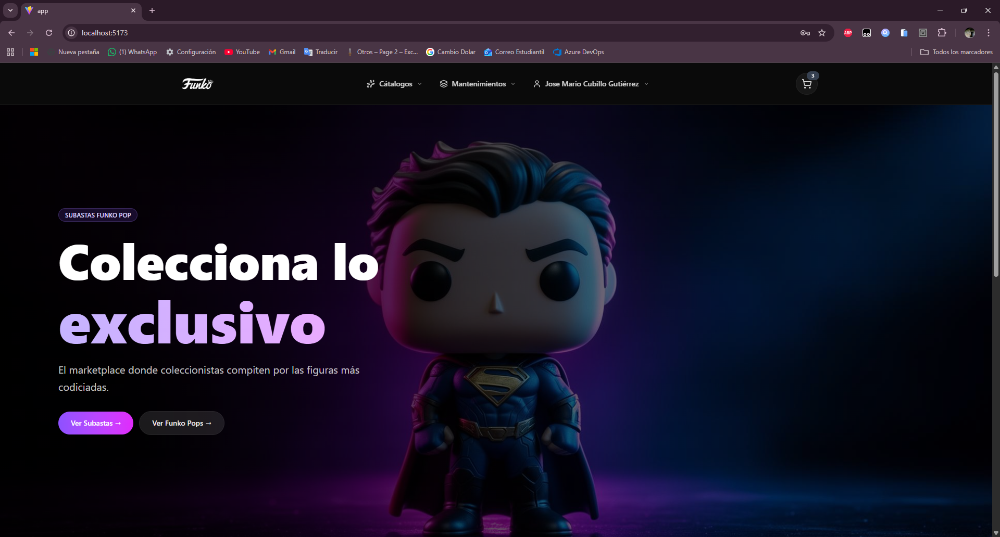

---

### Inicio con carrusel

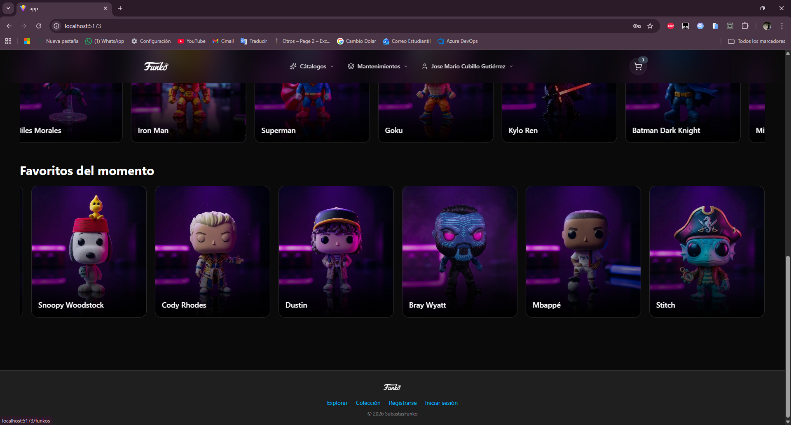

---

### Catálogo de subastas

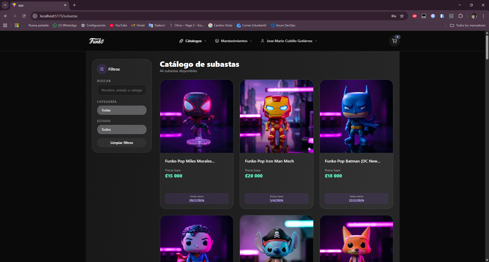

---

### Crear cuenta

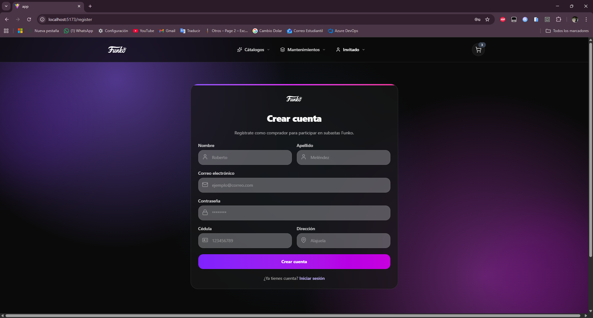

---

### Iniciar sesión

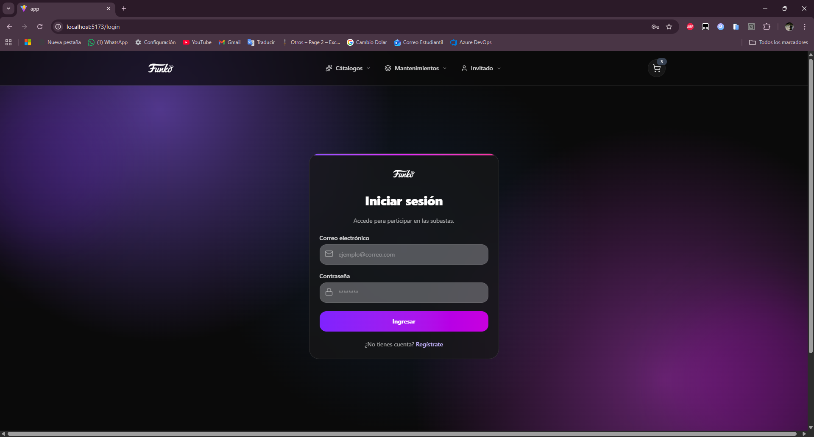

---

### Detalle de subasta

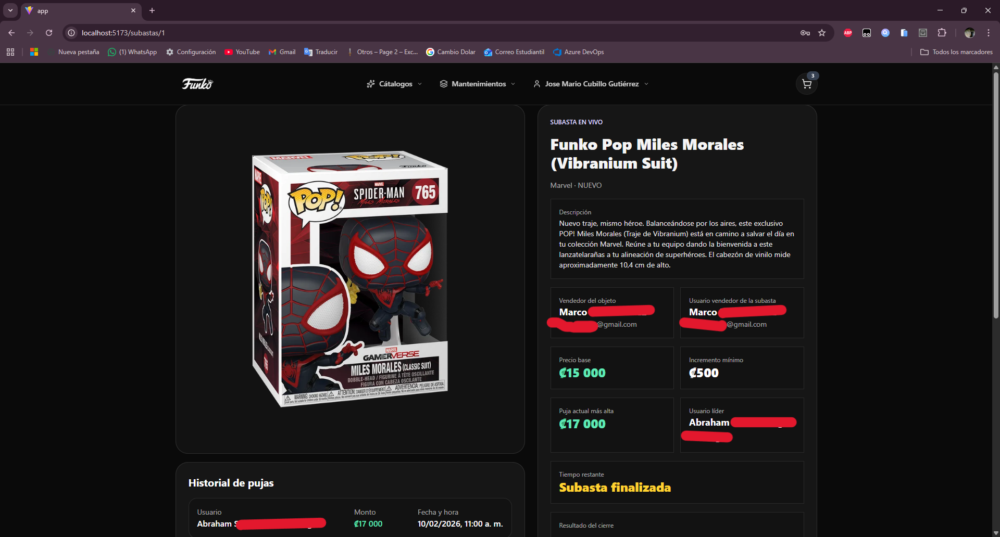

---

### Historial de pujas

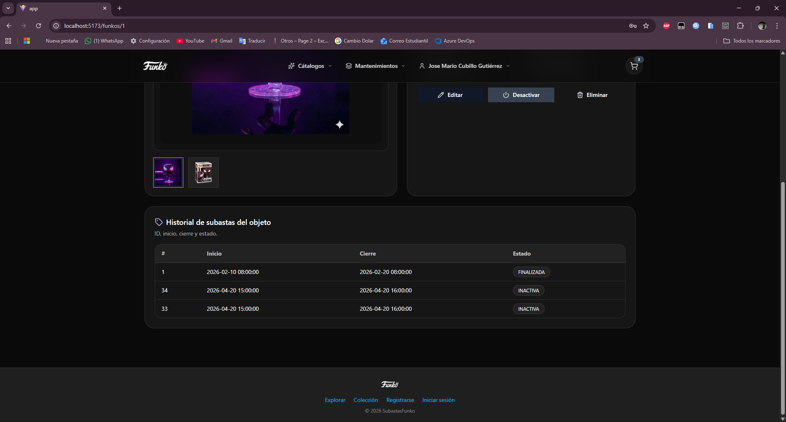

---

### Detalle mantenimiento de subasta

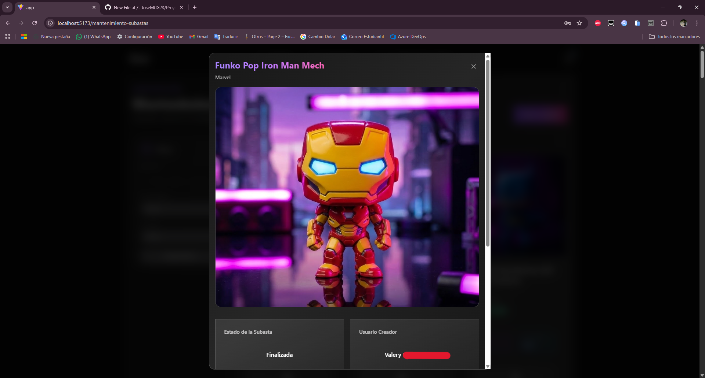

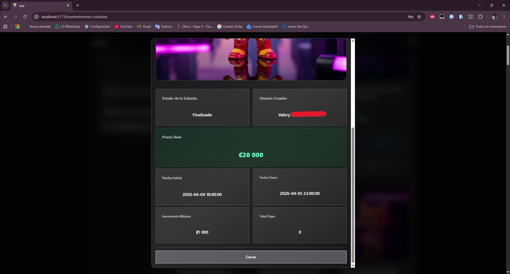

---

### Detalle de pujas

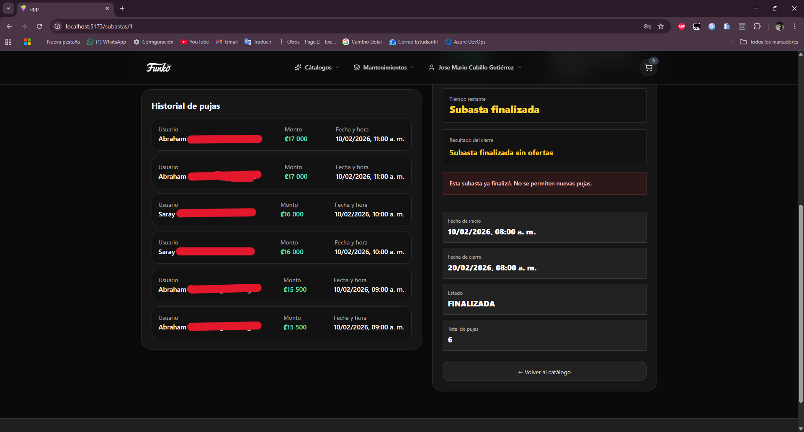

---

### Mantenimiento de subastas

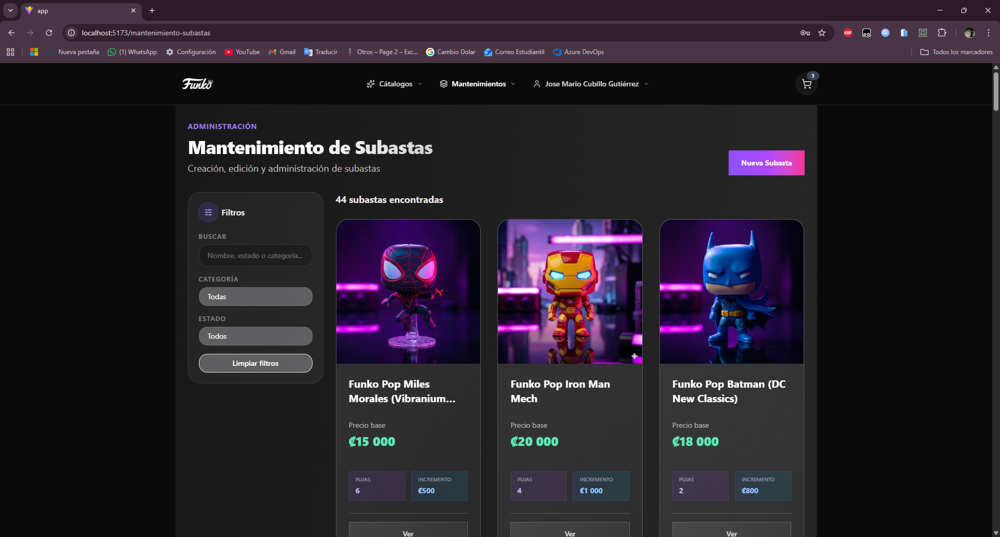

---

### Crear subasta

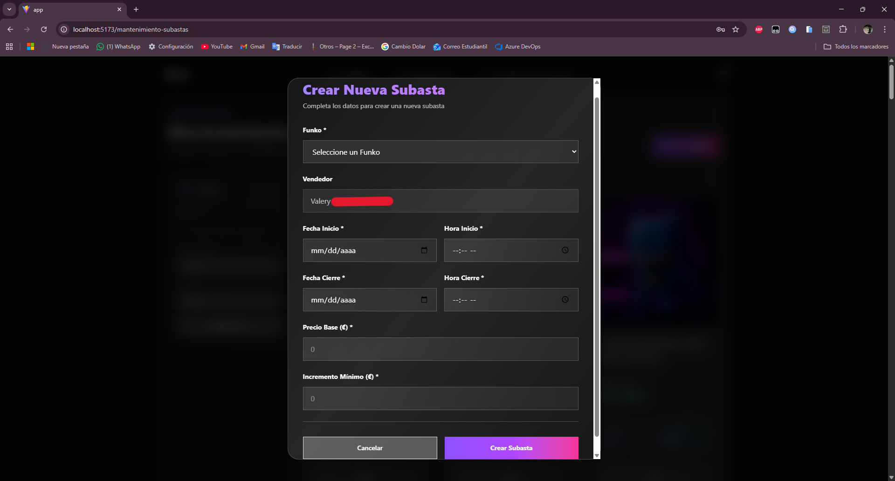

---

### Catálogo mantenimiento de funkos

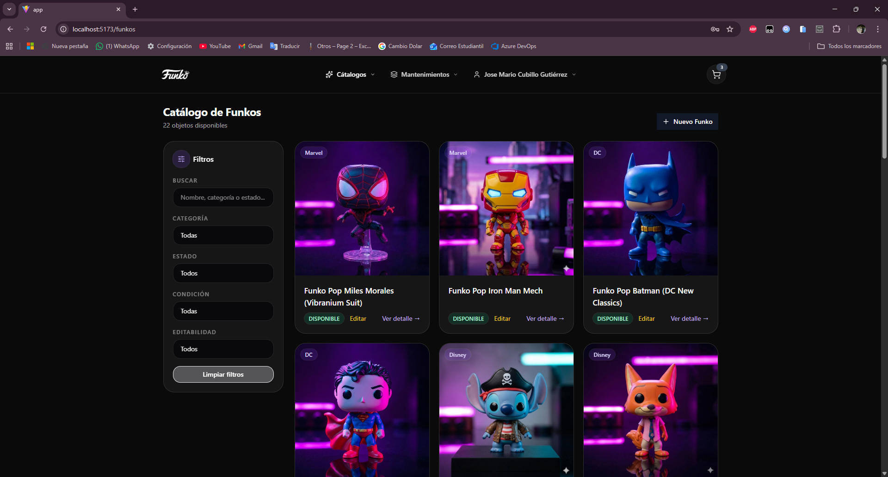

---

### Detalle de funko

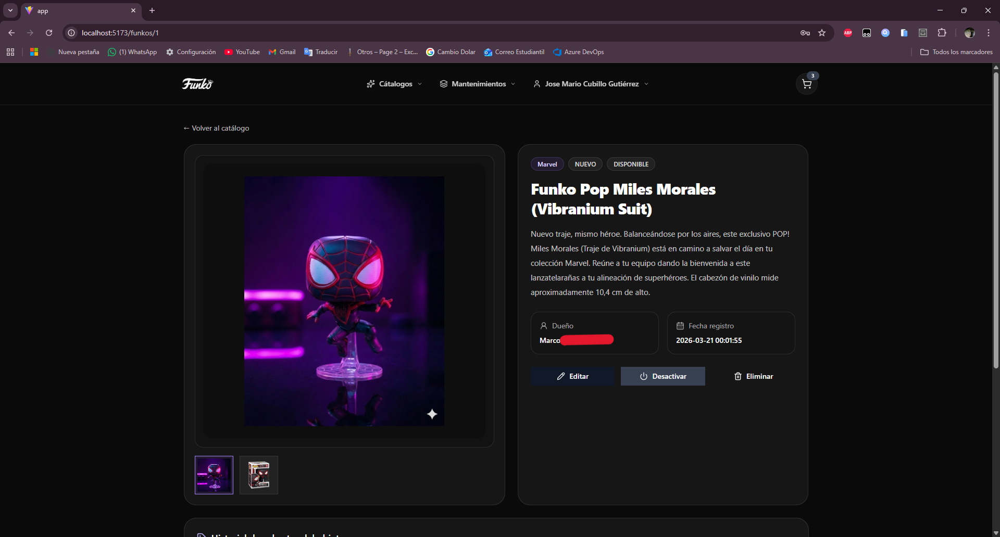

---

### Mantenimiento de usuarios

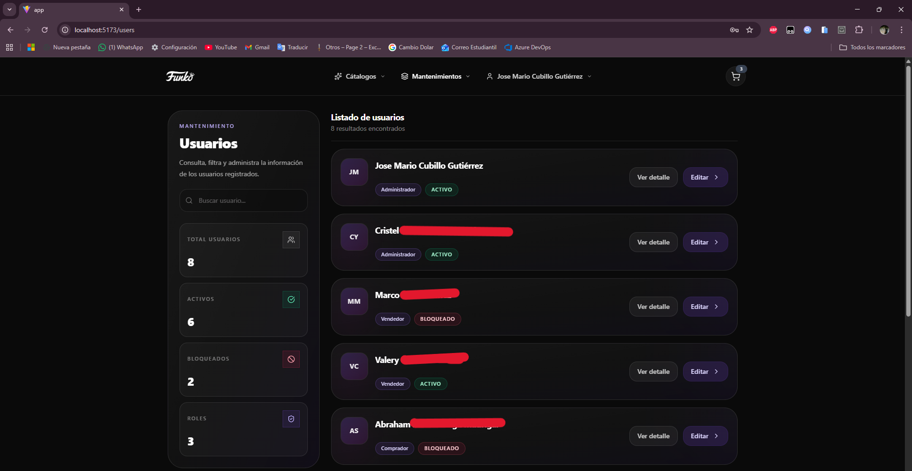

---

### Detalle de usuario

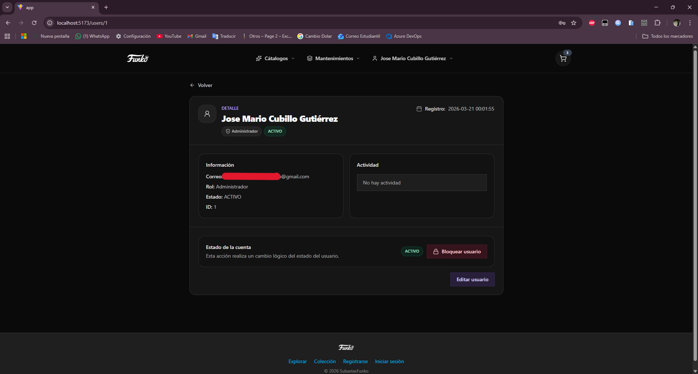

---

### Editar usuario

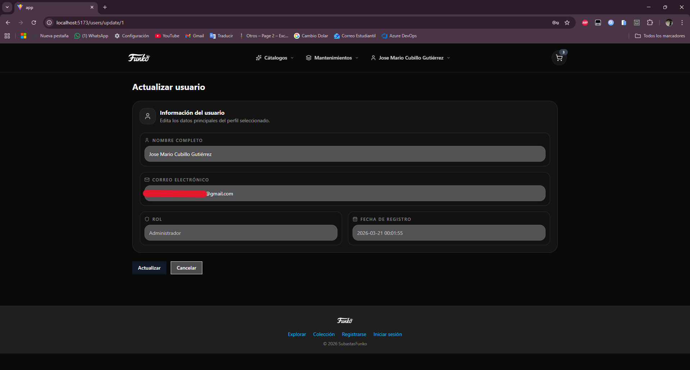

---

### Mi perfil

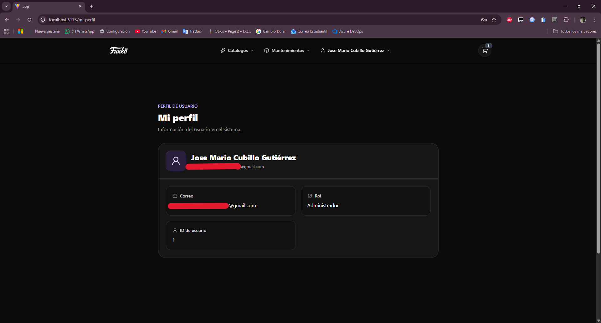

---

### Reportes

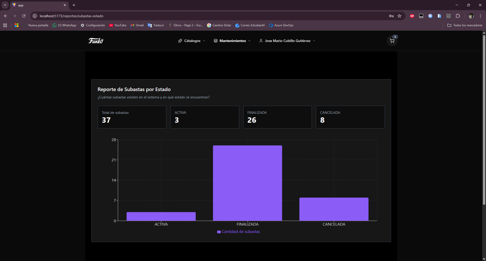
